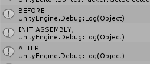

UniChain
====


<br>
<br>

```cs
class TestAspect {
  public static void Before() {
    Debug.Log("BEFORE");
  }
  public static void After() {
    Debug.Log("AFTER");
  }
}
```
```cs
class TestObject : MonoBehaviour {

  [Inject(typeof(TestAspect))]
  public void Init() {
    Debug.Log("INIT ASSEMBLY");
  }
}
```

Chain Methods
----
__Before__
```cs

```

__After__<br>
메소드가 정상 실행된 경우에 실행됩니다.
```cs
```

__Exception__<br>
메소드에서 익셉션이 발생한 경우 실행됩니다.
```cs
public static object Exception(object[] args, Exception e) {
  // 익셉션을 그대로 통과시키거나, 다른 익셉션으로 변환시키거나,
  // 아니면 익셉션을 무시하고 값을 리턴시킬 수 있습니다.
  // 
  // 1. 값을 반환하지 않고, e를 그대로 throw 합니다.
  //     throw e;
  // 2. 값을 반환시킵니다.
  //     return 0;
}
```
